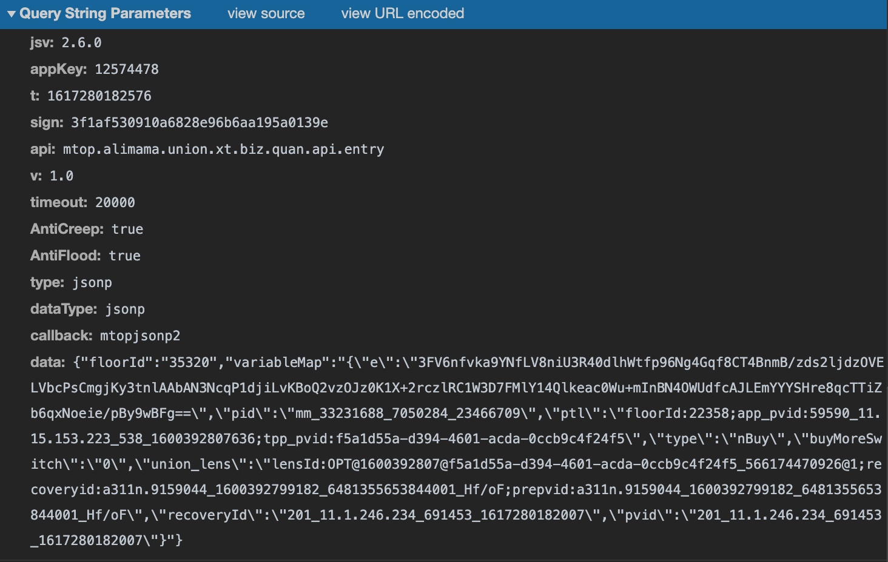
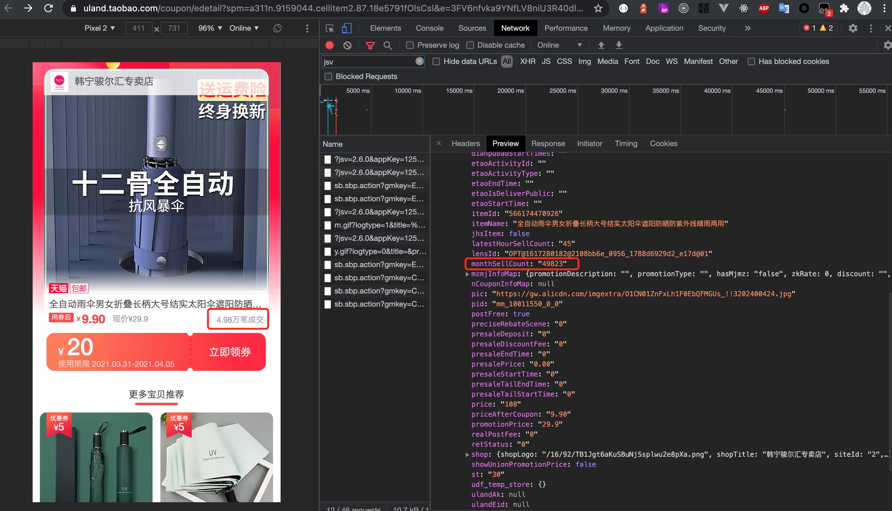
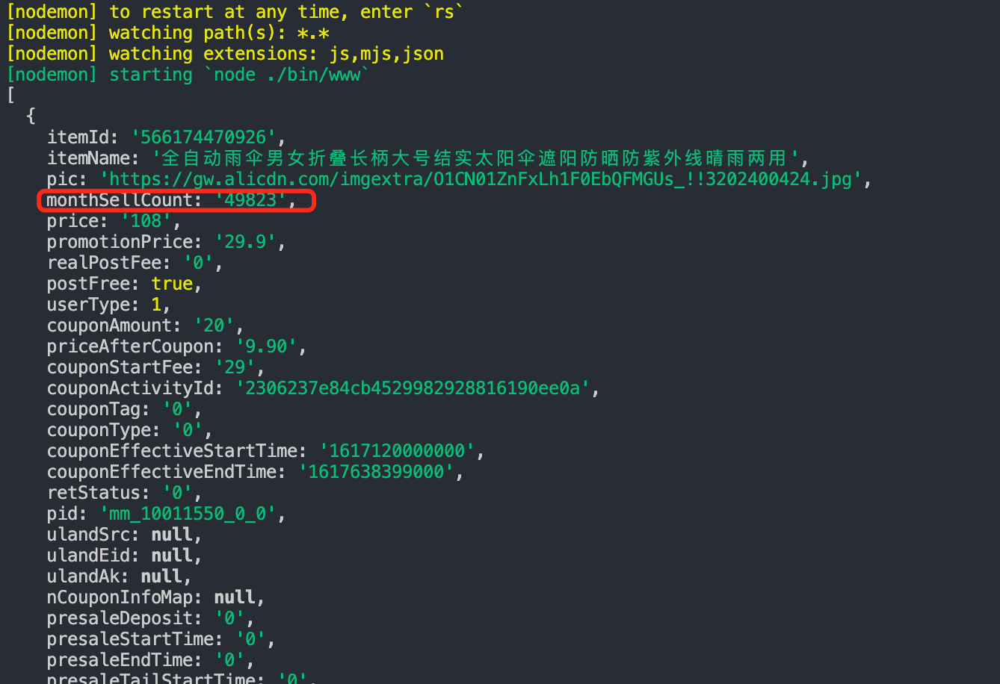

# uland-sell-data
利用接口批量获取[爱淘宝](https://uland.taobao.com/)商品的销量等数据

## 背景
做淘宝店，有种模式叫做“无货源”模式，简单来讲就是用程序脚本爬取淘宝一些商品的销量数据，通过数据筛选出卖的比较好的商品，再把商品信息复制到自己店铺上架，当然需要改下商品的标题，然后抬高一定的售价。如果有客户在你店铺下单，再用脚本自动去源商品下单，赚取差价。

## 难点
主要是参数反向破解加密比较麻烦，要去淘宝混淆过的代码里面分析出参数的加密过程，再还原出来。

请求参数实例如图：


接口返回如图：


代码参数返回示例：

## 运行
``` bash
# 下载依赖
yarn install
# 启动服务
yarn run start

```

## 接口测试
```bash
# 测试
yarn run start
```

仅做技术研究，切勿用于商业用途
